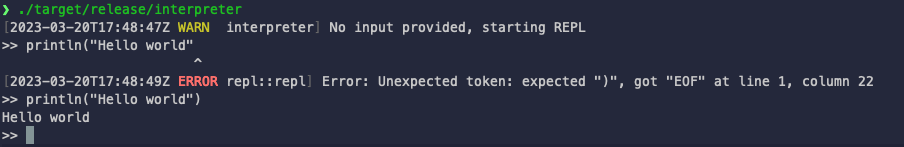

# Writing an interpreter in _~~Go~~_ **Rust**

https://interpreterbook.com/

## Why?

I wanted to read this book and I was learning Rust. So I decided to write the interpreter in Rust.

My knowledge of Rust is very limited, so I'm sure there are many things that could be done better. I'm open to suggestions and pull requests.
- In `evaluator.rs` many clones are made, causing multiple issues (push, closure, etc). I'm not sure how to get around this.
  - I should use refs, but with lifetime etc it's painful.

## How to run

- `cargo test` to run the tests
- `cargo build --release` to build a release version
  - The output will be `target/release/interpreter`

Once built, you can run the interpreter in two ways:
- `interpreter -h` to see the help
- `interpreter -f <file>` to run a file
  - You can fine some files in the `examples` folder
- `interpreter -e <expression>` to run an expression
  - You can run multiple expressions by separating them with a semicolon

## Builtins

You can find the implementation of the builtins in `evaluator/src/builtins`.

- `len` - returns the length of a string
- `first` - returns the first element of a list
- `last` - returns the last element of a list
- `rest` - returns all elements of a list except the first
- `push` - adds an element to the end of a list
- `pop` - removes the last element of a list
- `print` - prints a value to the console
- `println` - prints a value to the console with a newline